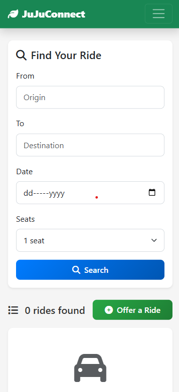
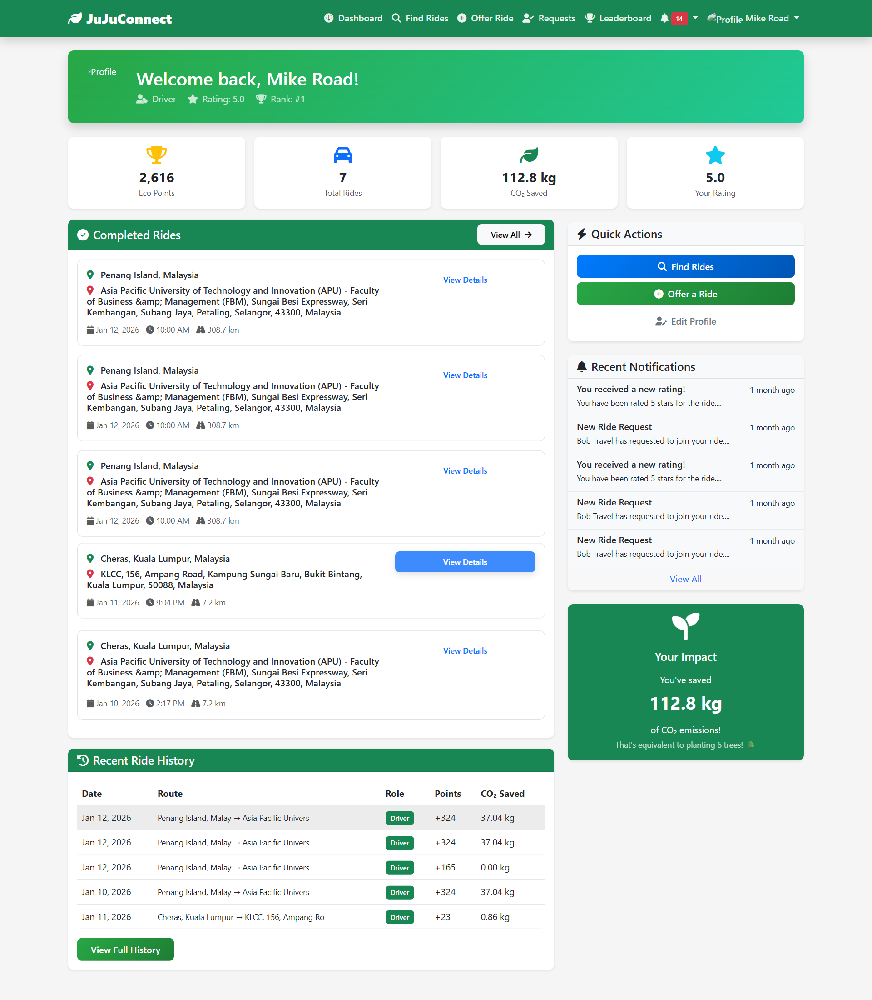
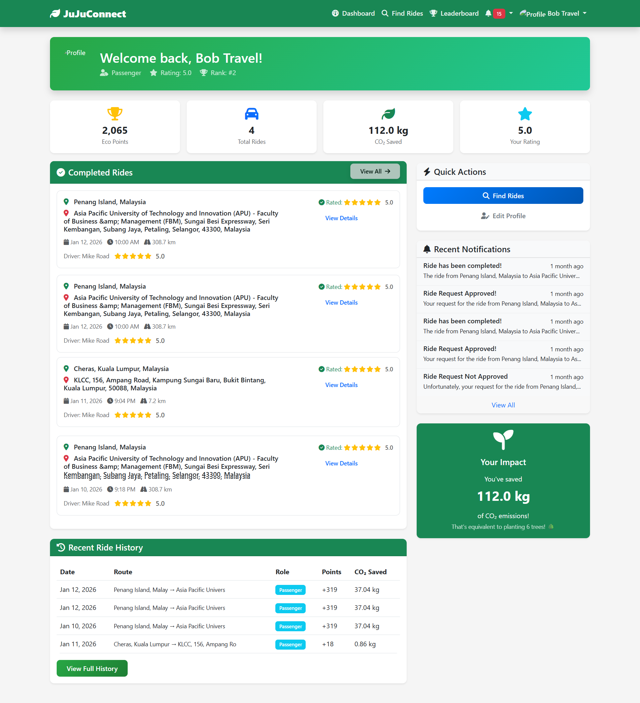
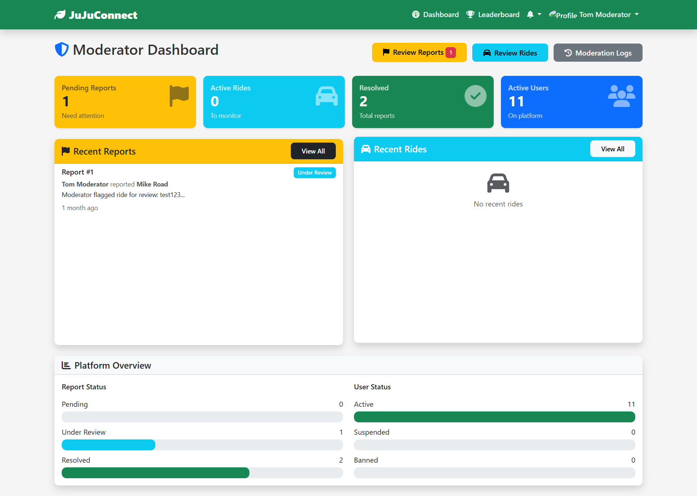
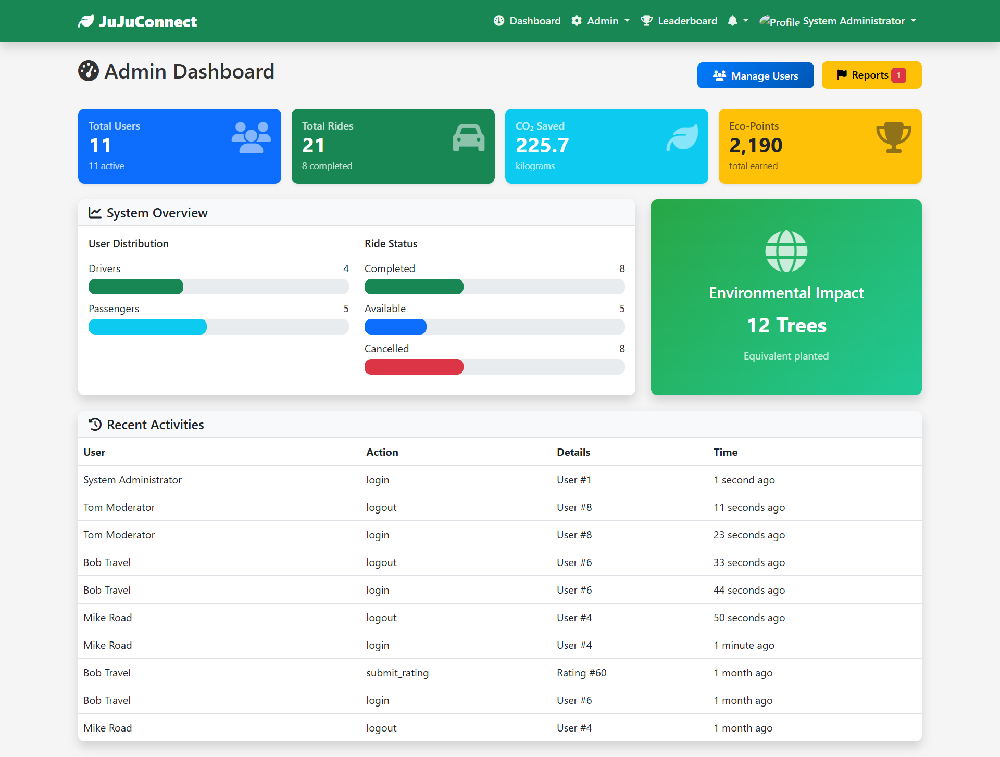

# 🌿 JuJuConnect - Sustainable Carpooling Platform
## 📖 Project Overview
JuJuConnect is a web-based carpooling application designed to promote sustainable transportation and reduce carbon emissions within the university community. By connecting drivers and passengers with matching routes, the platform encourages eco-friendly commuting through gamification and environmental tracking.

This project was developed as a comprehensive exercise in full-stack web development, relational database architecture, and system integration. 

## 🎯 My Role & Technical Focus
My primary focus in developing this platform was **System Architecture and Database Design**. 

Rather than manually coding every frontend component, I took a systems-level approach:
1.  **Database Architecture:** Designed a fully normalized Entity-Relationship Diagram (ERD) consisting of 12 distinct tables.
2.  **System Logic:** Mapped out the complex relationships between user profiles, ride histories, live seating availability, and eco-point calculations.
3.  **AI-Assisted Integration:** Leveraged AI tools to rapidly prototype the PHP/HTML/CSS boilerplate based on my strict database schema, allowing me to focus on testing, debugging, and integrating the core backend logic (PDO, sessions, and SQL JOINs).

## 🛠️ Tech Stack & Implementation
* **Database:** MySQL (Implemented foreign key constraints, 4 automated triggers, and stored procedures to handle live seat management).
* **Backend:** PHP 7.4+ (Utilized PDO with prepared statements for SQL injection prevention, and secure session management for role-based access).
* **Frontend:** HTML5, CSS3, JavaScript, Bootstrap 5.3 (Responsive, mobile-first design).

## 📸 Project Interface & Dashboards
The platform features role-specific interfaces designed for clear navigation and data visualization.

**Mobile Search Interface**

**Driver Dashboard:** Tracks completed rides, eco-points earned, and CO₂ saved.

**Passenger Dashboard:** Displays booked rides, impact metrics, and quick actions to find rides.

**Moderator Dashboard:** Dedicated workspace for reviewing user reports and monitoring platform safety.

**System Administrator Dashboard:** High-level analytics tracking total users, system-wide environmental impact, and user distribution.

## 👥 Core System Features by User Role
The system handles interactions, permissions, and session management for four distinct user roles:

* **Driver:** Can create ride offers, approve/reject passenger requests, and automatically track earned eco-points and CO₂ savings.
* **Passenger:** Can search for rides using dynamic filters, request seats, and leave driver ratings.
* **Moderator:** Equipped with a dashboard to review flagged rides, handle user conduct reports, and suspend accounts if necessary.
* **Administrator:** Has full system oversight, including access to platform-wide analytics, user management, and global point configuration.

## 🧠 Key Learnings
Building JuJuConnect solidified my understanding of fundamental software engineering concepts. Specifically, it taught me how to securely manage HTTP state using PHP sessions across different user roles, how to protect databases using prepared statements, and how to use `LEFT JOIN` operations to cleanly display relational data (like matching a `DriverID` to a specific user profile) on the frontend.
